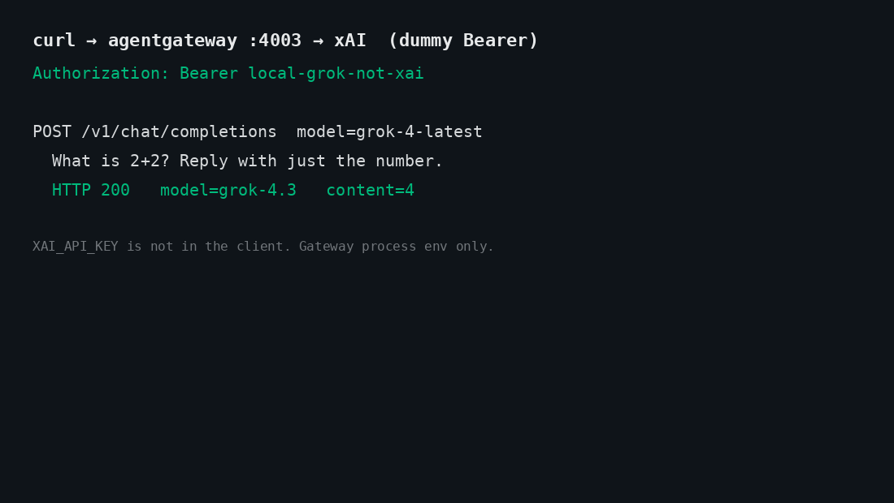
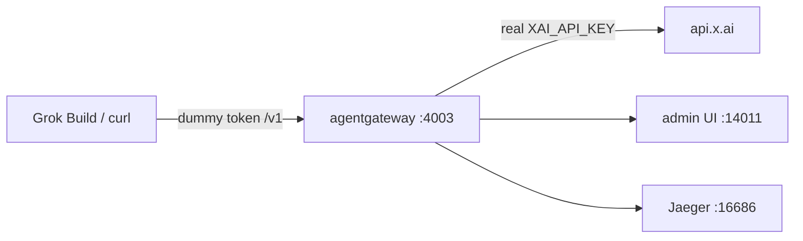
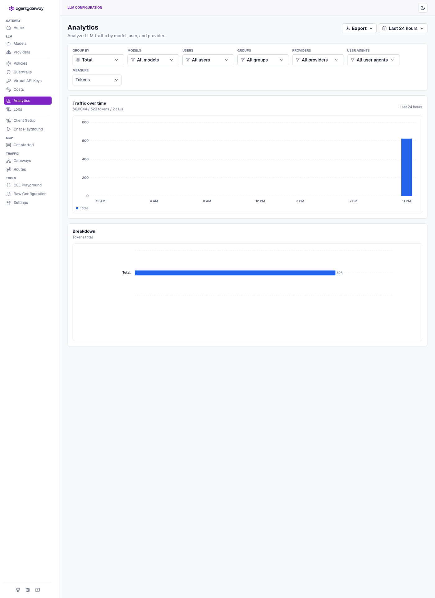
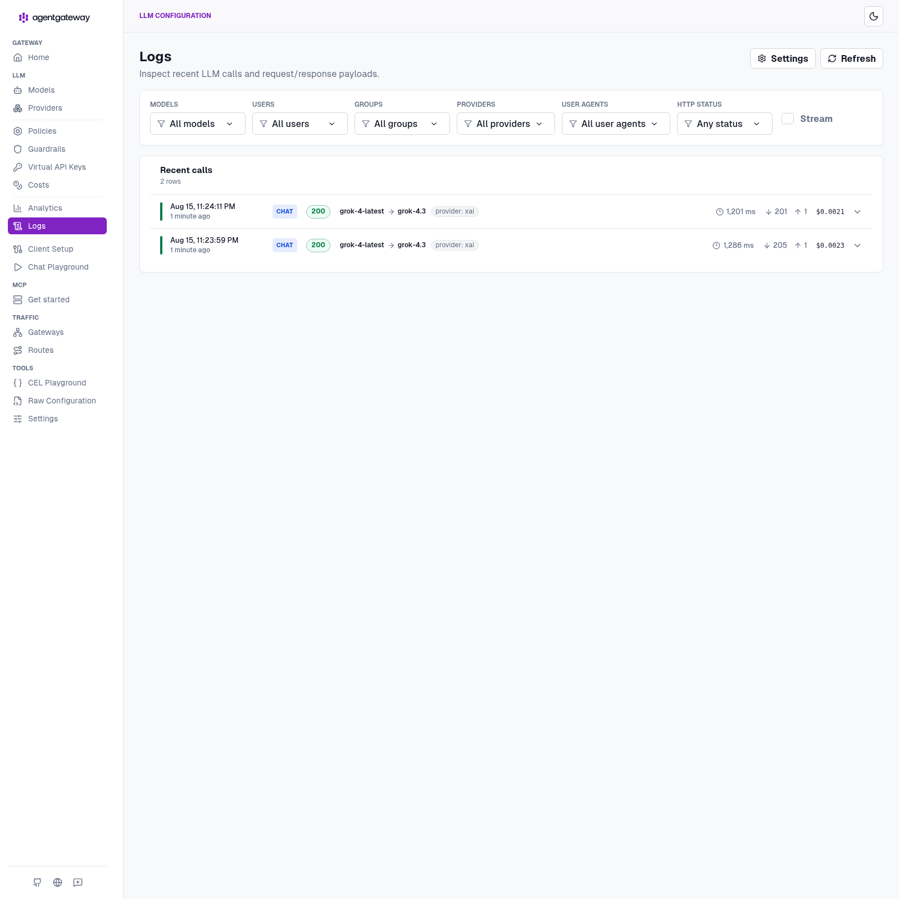
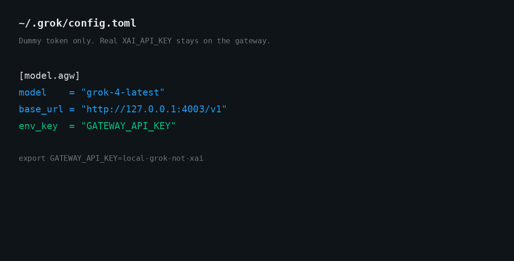

# Grok Build + agentgateway

Run **standalone agentgateway** in front of **Grok Build** (or any OpenAI-compatible client), so the client never sees your real xAI key.

The client talks to `http://127.0.0.1:4003/v1` with a dummy token. The gateway is the only process that holds `XAI_API_KEY`, and it is where token counts, USD cost, and traces show up. This is the setup we actually ran on one box — no cluster required.

The kind / passthrough runbook that used to live here is still at [docs/grok-passthrough-kind.md](docs/grok-passthrough-kind.md). That path forwards the client's own `Authorization` header. This README is the other pattern: dummy inbound token, real key only on the gateway.



## How it works



| Piece | Holds the real key? | What it does |
| --- | --- | --- |
| Grok Build / curl | No — dummy token | Client. Speaks OpenAI-compatible to the gateway. |
| agentgateway (`:4003`) | **Yes** — process env only | Injects the real key, meters tokens and cost, emits traces. |
| Admin UI (`:14011`) | No | Analytics, Logs, and Costs for the traffic above. |
| Jaeger (`:16686`) | No | OTLP traces from the gateway. |

The key is not in GitHub, not in `~/.grok`, and not in the client process. A mode-600 file is sourced by [`start-agw.sh`](start-agw.sh) and exported into the gateway process only. The sample [`agentgateway.yaml`](agentgateway.yaml) carries a `$XAI_API_KEY` placeholder — no secret.

Official provider page: [xAI in standalone agentgateway](https://agentgateway.dev/docs/standalone/latest/llm/providers/xai/). Default upstream is `https://api.x.ai/v1`.

## Before you begin

You need:

- **agentgateway 1.4.1** and `agctl`, pinned.
- **Docker**, for Jaeger all-in-one (optional — skip [Step 3](#step-3-start-jaeger-optional) if you don't want traces).
- An **xAI API key** you are willing to put in a local mode-600 file. Create one at [console.x.ai](https://console.x.ai/).
- Optional: **Grok Build** (`grok`) if you want the TUI pointed at the gateway. `curl` is enough to prove the path.

Install the gateway and `agctl`, pinned to the version this guide was written against:

```bash
curl -sL https://agentgateway.dev/install | bash -s -- --version v1.4.1
agentgateway --version
```

## Step 1: Import the cost catalog

Do this once. It lands in `config.modelCatalog` and is what turns raw token counts into USD on the Costs page.

```bash
mkdir -p costs
agctl costs import --source models.dev --providers xai --out ./costs/catalog.json
```

If `xai` is not a models.dev provider id on your `agctl`, import without `--providers` and keep the file local. Do not commit `costs/catalog.json`.

## Step 2: Store the xAI key outside the repo

The real key goes in a mode-600 file. Do not commit it. Do not put it in the YAML.

```bash
mkdir -p .secrets
umask 077
printf 'export XAI_API_KEY=xai-...\n' > .secrets/xai.env
chmod 600 .secrets/xai.env
```

> **Note:** `start-agw.sh` refuses to start if this file is missing or if `XAI_API_KEY` is empty after sourcing it.

## Step 3: Start Jaeger (optional)

The sample config ships traces to `http://localhost:4317`. Bring up Jaeger all-in-one to receive them:

```bash
docker run -d --name jaeger \
  -e COLLECTOR_OTLP_ENABLED=true \
  -p 16686:16686 \
  -p 4317:4317 \
  -p 4318:4318 \
  jaegertracing/all-in-one:latest
```

Jaeger UI: http://127.0.0.1:16686

## Step 4: Start the gateway

```bash
./start-agw.sh
```

`XAI_API_KEY` now exists in this process and nowhere else. Confirm the gateway is up before you touch a client:

| Endpoint | URL |
| --- | --- |
| Admin UI | http://127.0.0.1:14011/ui |
| Analytics | http://127.0.0.1:14011/ui/llm/analytics |
| Logs | http://127.0.0.1:14011/ui/llm/logs |
| Costs | http://127.0.0.1:14011/ui/llm/costs |
| OpenAI-compat listener | `http://127.0.0.1:4003/v1` |
| Metrics | http://127.0.0.1:14032 |

Ports are **4003 / 14011** on purpose, so this instance can sit next to an OpenAI gateway on `4002 / 14010`.

## Step 5: Prove it with curl

Dummy inbound token. Real key stays on the gateway.

```bash
curl -sS http://127.0.0.1:4003/v1/chat/completions \
  -H "Content-Type: application/json" \
  -H "Authorization: Bearer local-grok-not-xai" \
  -d '{
    "model": "grok-4-latest",
    "messages": [
      {"role": "user", "content": "What is 2+2? Reply with just the number."}
    ]
  }' | jq
```

Then a second short turn so Analytics has more than one row:

```bash
curl -sS http://127.0.0.1:4003/v1/chat/completions \
  -H "Content-Type: application/json" \
  -H "Authorization: Bearer local-grok-not-xai" \
  -d '{
    "model": "grok-4-latest",
    "messages": [
      {"role": "user", "content": "Name the capital of France in one word."}
    ]
  }' | jq
```

Official agentgateway docs use `grok-2-latest`. xAI's current flagship id is `grok-4-latest` (or `grok-4.6` if that is what your console lists). If one 404s, list models through the same listener:

```bash
curl -sS http://127.0.0.1:4003/v1/models \
  -H "Authorization: Bearer local-grok-not-xai" | jq
```

This box: both returned **200**. `grok-4-latest` routed to `grok-4.3`. Answers were `4` and `Paris`.


Open **Analytics** and **Logs** on the admin UI. You want `CHAT` / `200` rows with provider `xai`. No key on those pages.

This run: **$0.0044 / 623 tokens / 2 calls**.






## Step 6: Point Grok Build at the gateway

Grok Build reads `~/.grok/config.toml`. Add a custom model that talks to the gateway with the **dummy** token, not `XAI_API_KEY`.



```toml
[model.agw]
model = "grok-4-latest"
base_url = "http://127.0.0.1:4003/v1"
env_key = "GATEWAY_API_KEY"

[models]
default = "agw"
```

```bash
export GATEWAY_API_KEY=local-grok-not-xai
grok
```

`env_key` is the name of an env var Grok Build reads. That var is the dummy. The real xAI key never enters `~/.grok`.

Switch models in the TUI with `/model` or `grok -m agw`.

## Troubleshooting

| Symptom | Cause | Fix |
| --- | --- | --- |
| `missing .secrets/xai.env` on start | The mode-600 key file doesn't exist | Redo [Step 2](#step-2-store-the-xai-key-outside-the-repo) |
| Upstream 401 | `XAI_API_KEY` empty or wrong after sourcing | Check the 600 file. Do not put the key in the YAML. |
| Model 404 | The id is not on your xAI account | `GET /v1/models` through the gateway and pick one you have |
| No rows in Analytics or Logs | Requests never hit `:4003`, or `config.database` is missing | Recheck the client base URL. The sample YAML includes `sqlite://./data.db?mode=rwc`. |
| Port already in use | Another agentgateway is on `4002` / `14010` | This config uses `4003` / `14011` on purpose |

## Reference

**Endpoints**

| What | Where |
| --- | --- |
| agentgateway admin | http://127.0.0.1:14011/ui |
| Analytics | http://127.0.0.1:14011/ui/llm/analytics |
| Logs | http://127.0.0.1:14011/ui/llm/logs |
| Costs | http://127.0.0.1:14011/ui/llm/costs |
| Jaeger | http://127.0.0.1:16686 |
| OpenAI-compat listener | `http://127.0.0.1:4003/v1` |
| Metrics | http://127.0.0.1:14032 |

**Files**

| What | Where |
| --- | --- |
| Gateway config (no secret) | [`agentgateway.yaml`](agentgateway.yaml) |
| Gateway launcher | [`start-agw.sh`](start-agw.sh) |
| Kind passthrough runbook | [`docs/grok-passthrough-kind.md`](docs/grok-passthrough-kind.md) |
| Kubernetes manifests | [`k8s/`](k8s/) — see [`k8s/README.md`](k8s/README.md) |
| Kubernetes walkthrough | [`docs/kubernetes.md`](docs/kubernetes.md) |
| Real xAI key (mode 600, never committed) | `.secrets/xai.env` |
| Grok Build custom model | `~/.grok/config.toml` |

**Captures** — stills and clips live in [`docs/shots/`](docs/shots/), keyed to the steps above:

| File | What |
| --- | --- |
| `curl-run.gif` | Two dummy-token curls: `4` and `Paris` |
| `curl-run.png` | Same still |
| `grok-config.gif` | `~/.grok/config.toml` — `agw` model, dummy `env_key` |
| `agw-costs.gif` | Admin UI — Overview → Analytics → Logs |
| `agw-logs.gif` | Analytics then Logs |
| `agw-ui.png` | Analytics — $0.0044 / 623 tokens / 2 calls |
| `agw-logs.png` | Logs — two `CHAT` / `200` rows, `grok-4-latest` → `grok-4.3` |
| `agw-admin.png` | Gateway Overview |

Standalone only. No cluster screenshots. No real API key in any capture.

Standalone first. No real API key in any capture.

## Next steps

- **Kubernetes** — same dummy-token pattern, with a Secret instead of a mode-600 file. Manifests are in [`k8s/`](k8s/); the walkthrough is [docs/kubernetes.md](docs/kubernetes.md). Untested — we did not stand a cluster up for this repo.

  ```bash
  ./k8s/install.sh   # Gateway API + agentgateway charts, Secret, cost catalog, manifests
  ```
- **Kind passthrough** — client holds the key, gateway forwards `Authorization`. That is the older runbook: [docs/grok-passthrough-kind.md](docs/grok-passthrough-kind.md).
- **MCP** — not wired in this first pass. Same gateway in the middle, later.
